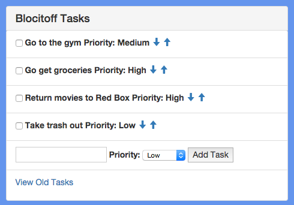
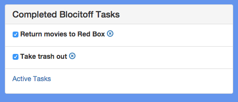

Blocitoff is a web application that will manage your to-do lists by automatically deleting tasks that have not been completed after seven days. Once tasks have been deleted from the active tasks window, they can be viewed and permenantly deleted.

The biggest challange I had building this application was making Angular work with Firebase, a realtime database. 

Blocitoff was built using HTML5, CSS3, AngularJS, and Firebase.

