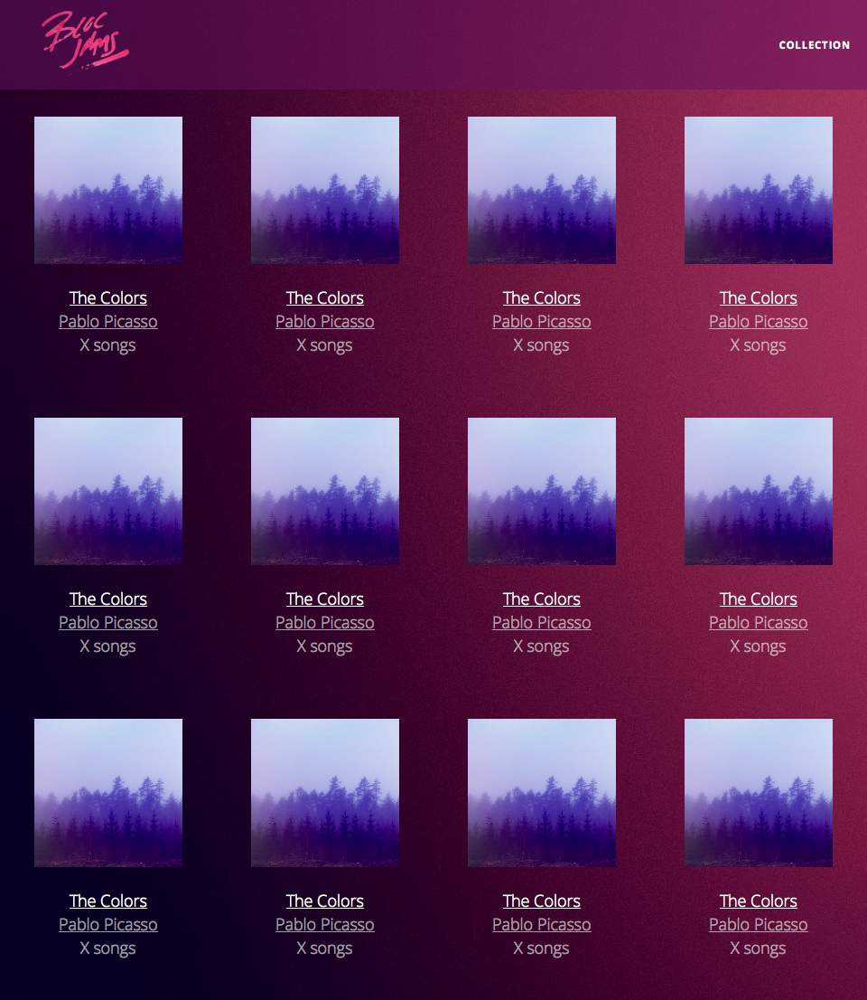
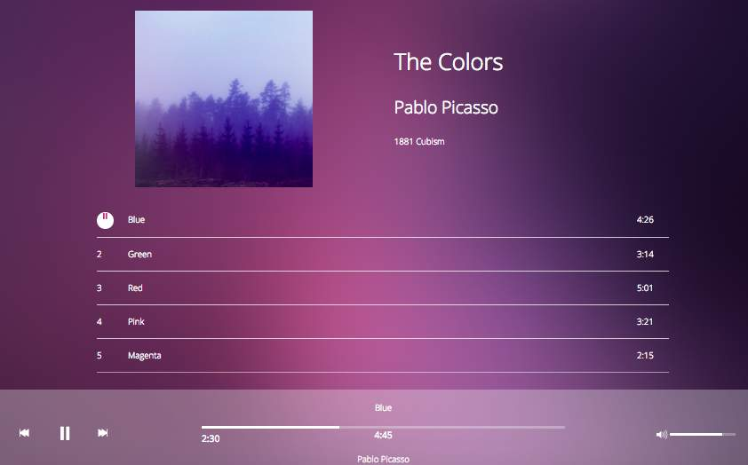

BlocJams is a digital music application like Spotify that allows the user to play music and use interactive scroll bars and volume controls. This was the first project I had to build which brought together all the foundation skills from previous challenges in Bloc.

BlocJams was built using HTML5, CSS3 and AngularJS. 

View project <a href="http://blocjams-dan.herokuapp.com/">here</a>.

