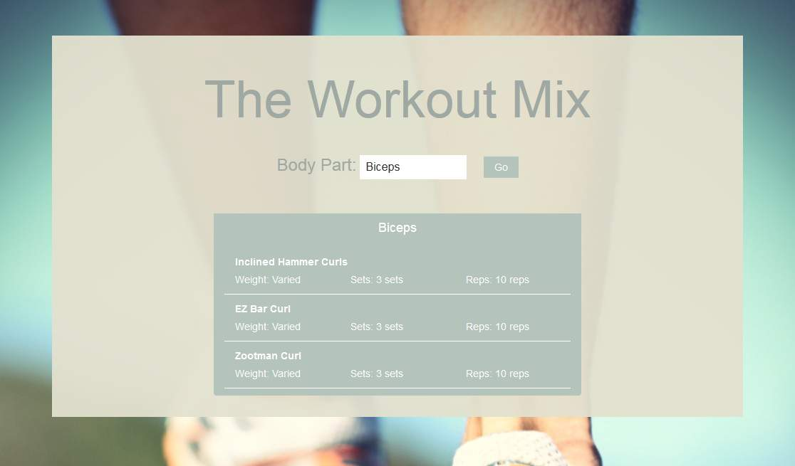

Workout Mix is my capstone project for the Bloc program. I came up with the idea for this project when I was at the gym and found that I was always doing the same type of workout. With this application a user will be able to select a specific body part and get 3 random workouts. This should help with keeping a workout routine fresh.

Workout Mix was built using HTML5, CSS3 and AngularJS. 

