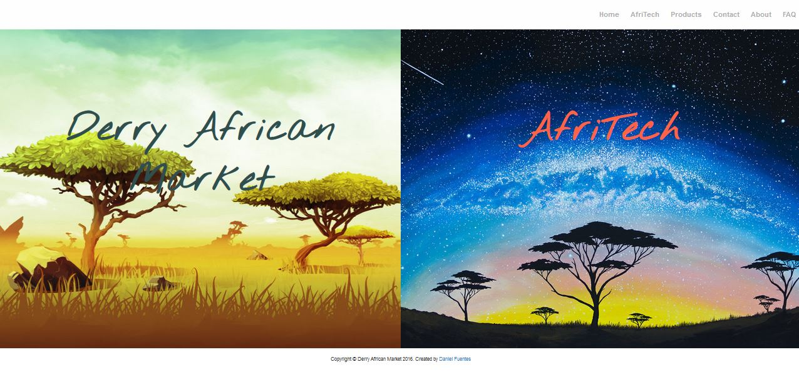

Derry African Market is a redesign for a website that I created in my last year of college. 
I have wanted to learn the Jade Template Engine for a while now, and so I used to create this new design.
What was unique about this website is that they wanted to showcase the African goods they provide as well as computer repair services they offer.
To do just that, I made the front page have a 2 section layout, so that users can easily navigate to the desired destination.

Derry African Market was built using HTML5, CSS3, Jade, and Bootstrap.

View project <a href="http://imdanielfuentes.com/daf/">here</a>

